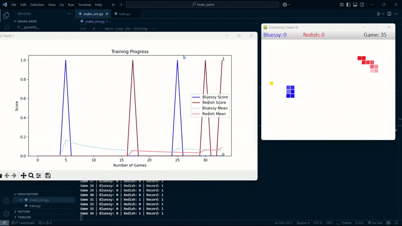

# Snake's & The Golden Apple

**Snake's & The Golden Apple** is a competitive rendition of the classic Snake game where two AI-controlled snakes learn to navigate, gather apple, and avoid collisions using Deep Q-Learning (DQN). This project showcases reinforcement learning (RL) in a dynamic, adversarial environment.



## Technical Overview

### Reinforcement Learning Mechanics

- **State Representation:**  
  Each snake's state is defined by 11 parameters:
  - Danger indicators: Straight ahead, right, and left (binary values).
  - Current movement direction: Encoded as up, down, left, or right.
  - apple position relative to the snake's head: Indicators for apple being left, right, up, or down.

- **Action Set:**  
  The snakes can execute one of three actions:
  - `[1, 0, 0]`: Move straight.
  - `[0, 1, 0]`: Turn right.
  - `[0, 0, 1]`: Turn left.

- **Reward System:**  
  - **Positive Reward:** +10 points for consuming apple.
  - **Negative Reward:** -10 points for collisions with walls or the other snake.
  - **Neutral Reward:** 0 points for each move without incident.

- **Learning Process:**  
  Utilizing Deep Q-Networks (DQN), the snakes employ experience replay and an epsilon-greedy strategy to balance exploration and exploitation. Over time, they refine their strategies to optimize performance.

### Project Structure

- **`snake_env.py`**: Defines the game environment using Pygame.
- **`model.py`**: Contains the DQN and agent implementations.
- **`train.py`**: Manages the training loop and visualizations.
- **`environment.yml`**: Specifies the Conda environment configuration.

## Setup and Execution

1. **Create the Conda Environment:**
   ```bash
   conda env create -f environment.yml
   ```

2. **Activate the Environment:**
   ```bash
   conda activate snake_rl
   ```

3. **Set OpenMP Environment Variable:**
   ```bash
   export KMP_DUPLICATE_LIB_OK=TRUE
   ```

4. **Initiate Training:**
   ```bash
   python train.py
   ```

## Visual Experience
Upon running the training script:
* **Game Window:**
   * **Blue Snake:** Represents the first AI agent.
   * **Green Snake:** Represents the second AI agent.
   * **Red Squares:** Indicate apple locations.
   * **Score Display:** Located in the top-left corner.
* **Training Plot:**
   * Real-time plotting of scores for both snakes.
   * Moving averages to illustrate learning progress.
   * Updates after each game.

## Learning Phases
1. **Initial Phase:**
   * Predominantly random movements.
   * Basic survival skills development, such as avoiding walls.
2. **Intermediate Phase:**
   * Emergence of apple-seeking behavior.
   * Improved collision avoidance.
3. **Advanced Phase:**
   * Development of sophisticated strategies.
   * Enhanced competition for apple.
   * Superior survival techniques.

## Controls
* **Terminate Training:**
   * Close the game window or press `Ctrl+C` in the terminal.
* **Progress Persistence:**
   * The training process automatically saves the best scores.
   * Each session builds upon previous learning.

## Notes
* **Exploration vs. Exploitation:**
   * The snakes begin with high exploration, making random moves, and gradually shift towards exploitation as they learn effective strategies.
* **Training Duration:**
   * Significant improvements may require several hours of training.
* **Visualization:**
   * The matplotlib window provides real-time insights into learning progress.
* **Hardware Considerations:**
   * This implementation is optimized for CPU-only systems and does not require a dedicated GPU.

## License
This project is licensed under the MIT License.

Embark on this journey to observe how AI agents evolve from random movements to strategic competitors in the quest for apple!
